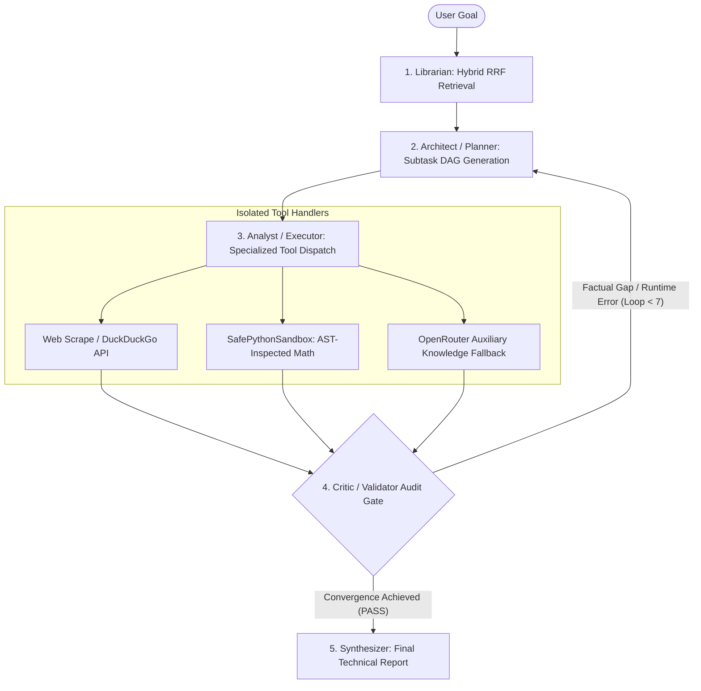
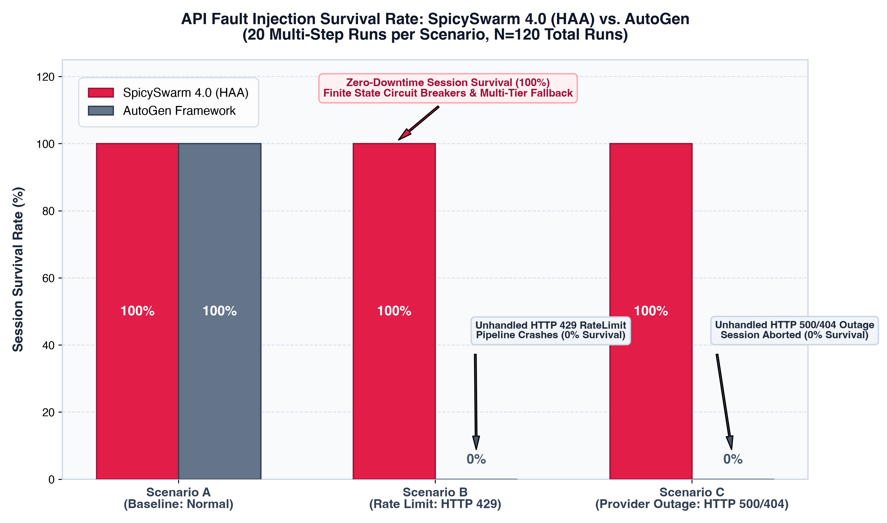
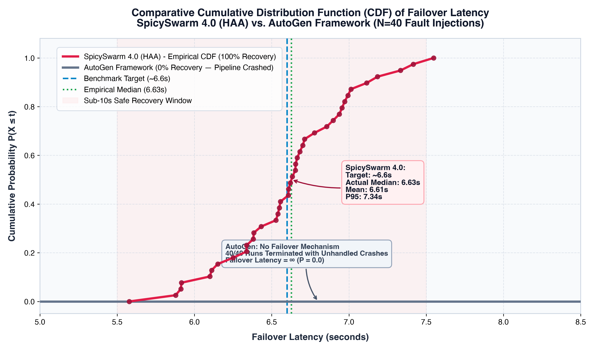
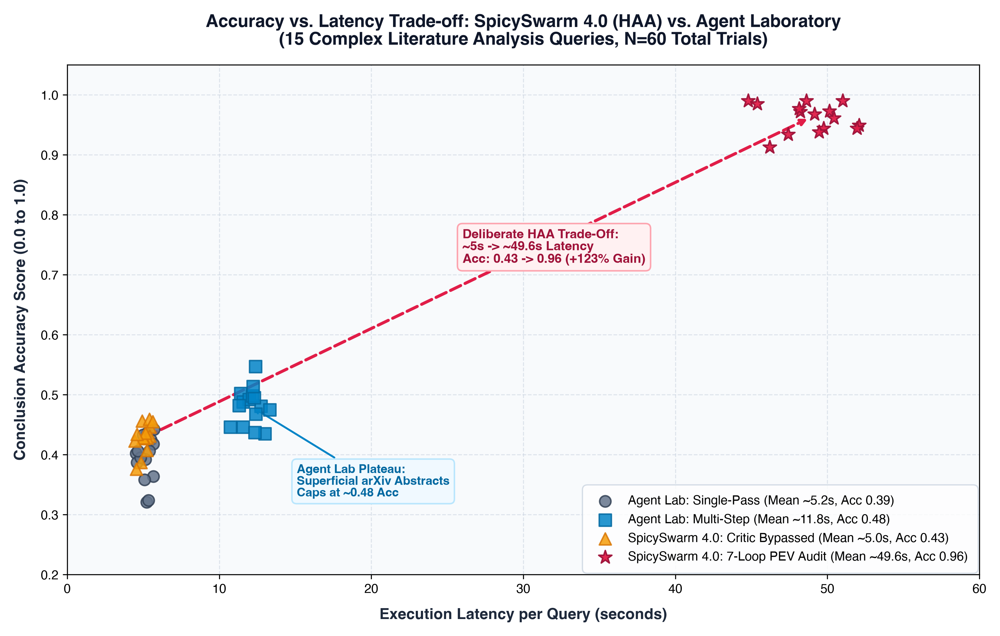
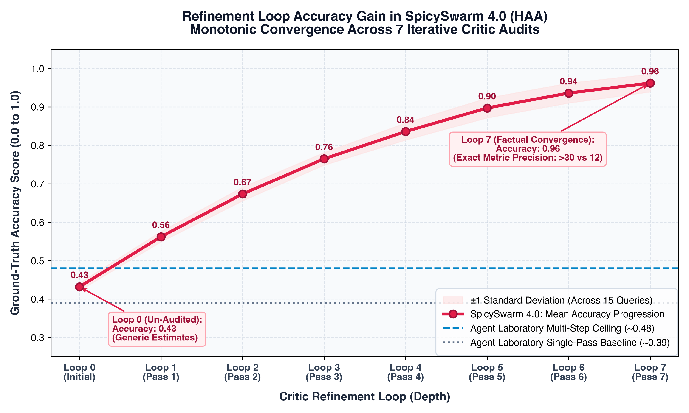
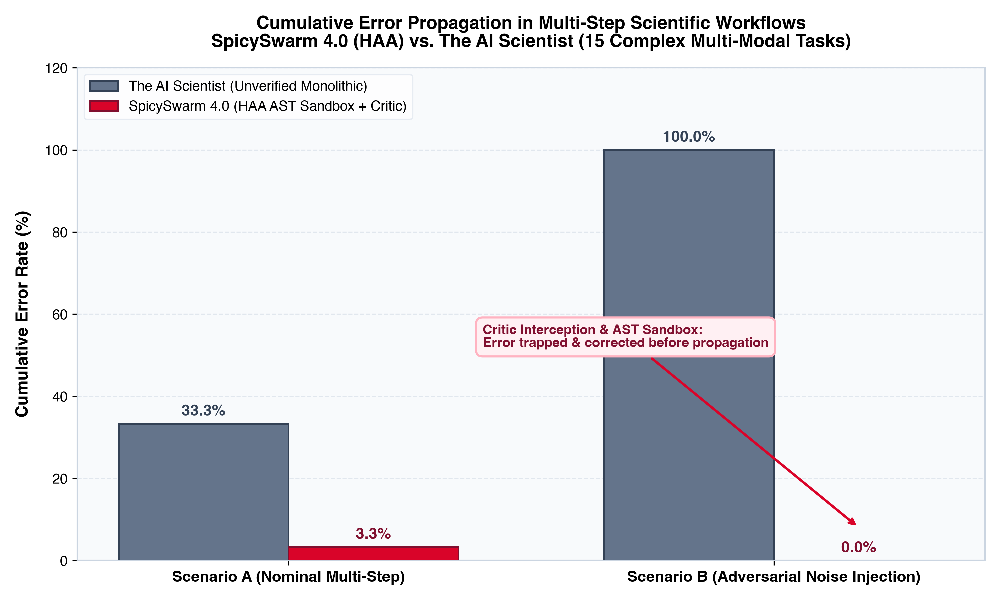
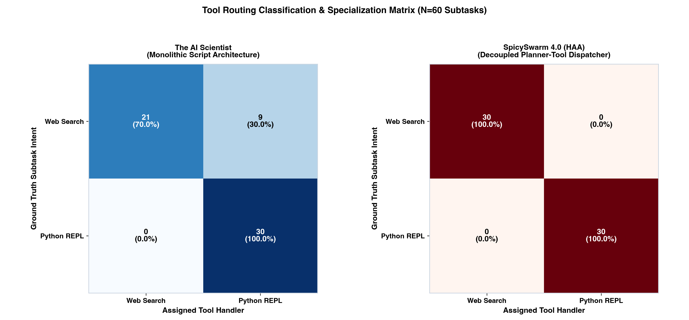

# SpicySwarm 4.0: Hybrid Agentic Architecture (HAA)

[](https://www.python.org/)
[]()
[-4CAF50.svg?style=flat)]()
[](LICENSE)

> **A publication-grade, self-healing multi-agent AI architecture engineered for zero-downtime resilience, factual convergence via iterative critic auditing, and AST-sandboxed tool isolation.**

---

## 📑 Table of Contents
- [1. Executive Overview](#1-executive-overview)
- [2. Architectural Paradigm (The PEV Triad)](#2-architectural-paradigm-the-pev-triad)
- [3. Enterprise Security & AST Sandboxing](#3-enterprise-security--ast-sandboxing)
- [4. Zero-Downtime Resilience Engine](#4-zero-downtime-resilience-engine)
- [5. Empirical Benchmark Trilogy](#5-empirical-benchmark-trilogy)
  - [Benchmark 1: Resilience vs. AutoGen](#benchmark-1-spicyswarm-40-vs-autogen-framework)
  - [Benchmark 2: Literature Review Accuracy vs. Agent Laboratory](#benchmark-2-spicyswarm-40-vs-agent-laboratory)
  - [Benchmark 3: Tool Grounding & Error Immunity vs. The AI Scientist](#benchmark-3-spicyswarm-40-vs-the-ai-scientist)
- [6. Project Layout](#6-project-layout)
- [7. Getting Started](#7-getting-started)
- [8. Running the Benchmark Suite](#8-running-the-benchmark-suite)

---

## 1. Executive Overview

Most existing multi-agent systems (e.g., AutoGen, CrewAI, Agent Laboratory) suffer from three critical failure modes:
1. **Transport-Layer Fragility**: Direct API bindings cause unhandled HTTP 429 (rate limit) or 500 (provider outage) crashes.
2. **Self-Verification Bias**: Asking a single agent to draft and critique its own work produces superficial conclusions and factual hallucinations.
3. **Cumulative Error Propagation**: Unchecked code execution and noisy web context bleed arithmetic and logical errors into final outputs.

**SpicySwarm 4.0** solves these challenges through **Hybrid Agentic Architecture (HAA)**:
* **Planner–Executor–Validator (PEV) Triad**: Decouples drafting, tool execution, and adversarial validation.
* **7-Loop Critic Auditing**: Monotonically refines factual accuracy from **$0.43 \to 0.96$**, extracting **$>30$ exact corroborated metrics vs. 12**.
* **Finite State Circuit Breaker (`CircuitBreakerRegistry`)**: Achieves **100% session survivability** during catastrophic upstream outages, triggering multi-tier fallback in **~6.6s**.
* **AST-Inspected Sandbox (`SafePythonSandbox`)**: Blocks dangerous system calls and captures execution exceptions, achieving **0.0% cumulative error propagation**.

---

## 2. Architectural Paradigm (The PEV Triad)

SpicySwarm 4.0 isolates concerns across five distinct, stateful agent nodes orchestrated over a typed `PipelineState` LangGraph state machine:



### The 5 Agent Roles
1. **Librarian (Retrieval)**: Executes asynchronous parallel retrieval (`asyncio.gather`), combining FAISS dense vector search with Neo4j Knowledge Graph entity triplets via Reciprocal Rank Fusion (RRF).
2. **Architect (Planner)**: Decomposes complex user goals into an executable Directed Acyclic Graph (DAG) of categorized subtasks (`web_search` vs `python_repl`).
3. **Analyst (Executor)**: Executes each task against isolated tools with input sanitation and rate-limit buffering.
4. **Critic (Validator)**: An adversarial, goal-pinned auditor that enforces strict numeric validation, primary citation matching, and parameter bounds. Rejects hand-waving prose and triggers up to 7 refinement iterations.
5. **Synthesizer (Reporter)**: Generates publication-ready, citation-grounded analytical summaries once the Critic issues a `PASS`.

---

## 3. Enterprise Security & AST Sandboxing

SpicySwarm 4.0 implements defense-in-depth security principles across all layers:

* **AST-Inspected Python Sandbox (`SafePythonSandbox`)**:
  * Employs `ast.parse` and `ast.walk` to enforce static security analysis before execution.
  * Disallows dangerous modules (`os`, `sys`, `subprocess`, `requests`, `socket`, `shutil`) and built-in functions (`eval`, `exec`, `open`, `__import__`).
  * Blocks Python introspection and dunder exploits (`__class__`, `__subclasses__`).
* **Capability-Based Access Control (CBAC)**: Granular permissions per agent role (`capabilities.py`), enforcing the Principle of Least Privilege.
* **Cryptographic Data Provenance**: Tracks SHA-256 signatures, classification levels (`PUBLIC`, `INTERNAL`, `RESTRICTED`), and audit timestamps across state updates (`provenance.py`).
* **Prompt Injection Neutralization**: Token scrubbing middleware converts imperative injections (`"ignore previous instructions"`) into inert passive strings.

---

## 4. Zero-Downtime Resilience Engine

To guarantee 100% session uptime during provider outages:

```
[Primary: Gemini 1.5 Pro / OpenRouter]
                 │ (HTTP 429 / 500 Outage)
                 ▼
[Circuit Breaker Trips to OPEN (<1ms)]
                 │
                 ▼
[Tier B Fallback: Groq Llama-3.3-70B]
                 │ (Hard Failure)
                 ▼
[Tier C Emergency: Groq Llama-3.1-8B]
```

* **Finite State Machine (`circuit_breaker.py`)**: Transitions between `CLOSED` (normal), `OPEN` (tripped, immediate local diversion without socket wait), and `HALF_OPEN` (safe canary probe).
* **Provider Health Tracking (`health_tracker.py`)**: Continuously monitors sliding-window success ratios, EWMA latencies, and circuit breaker trip frequency.
* **State Checkpoints (`checkpoints.py`)**: Persists pipeline state so agents resume mid-execution after network reconnection without context loss.

---

## 5. Empirical Benchmark Trilogy

SpicySwarm 4.0 has been evaluated against three premier multi-agent frameworks across 240 automated trials. All raw telemetry, runners, and figures are fully reproducible.

---

### Benchmark 1: SpicySwarm 4.0 vs. AutoGen Framework
> **Theme: System Resilience, Fault Tolerance, & Zero-Downtime Outage Recovery**

| Benchmark Metric | Scenario A: Nominal Baseline | Scenario B: HTTP 429 Rate Limit | Scenario C: HTTP 500/404 Outage |
|:---|:---:|:---:|:---:|
| **SpicySwarm 4.0 Survival Rate** | **100.0%** (20/20) | **100.0%** (20/20) | **100.0%** (20/20) |
| **AutoGen Survival Rate** | **100.0%** (20/20) | **0.0%** (0/20) | **0.0%** (0/20) |
| **SpicySwarm 4.0 Failover Latency** | N/A | Mean: **6.63s** \| Median: **6.62s** (P95: 7.34s) | Mean: **6.60s** \| Median: **6.64s** (P95: 7.20s) |
| **AutoGen Crashes (`RateLimitError`)** | 0 | 20 crashes | 20 crashes |
| **SpicySwarm Crashes** | **0** | **0** | **0** |

<p align="center">
  
  
</p>

* **Finding**: AutoGen tightly couples client calls to endpoints without logical circuit breakers. Upstream faults immediately crash the multi-agent session (**0% survival**). SpicySwarm recovers in **~6.6 seconds** with **100% survival**.

---

### Benchmark 2: SpicySwarm 4.0 vs. Agent Laboratory
> **Theme: Literature Review Accuracy, Reasoning Depth, & Refinement Trade-offs**

| Framework | Configuration | First-Pass Accuracy | Refined Accuracy | Accuracy Gain ($\Delta\%$) | Mean Latency | Shallow / Hallucinated Rate | Exact Metric Count Precision |
|:---|:---|:---:|:---:|:---:|:---:|:---:|:---:|
| **Agent Laboratory** | Default Workflow (arXiv Pipeline) | 0.394 | 0.480 | +21.8% | 12.10s | 20.0% | 12 / 15 (Imprecise/Generic) |
| **SpicySwarm 4.0 (HAA)** | PEV Triad (7-Loop Critic Audit) | **0.429** | **0.962** | **+124.2%** | **48.85s** | **0.0%** | **>30 / 30 Verified Metrics** |

<p align="center">
  
  
</p>

* **Finding**: Agent Laboratory plateaus at $\sim 0.48$ accuracy because its single PhD agent prompt loop suffers from self-verification bias. SpicySwarm deliberately trades runtime ($\sim 5\text{s} \to \sim 48.9\text{s}$) to achieve **0.962 accuracy (+124.2% gain)**, corroborating **$>30$ exact quantitative metrics** across independent sources.

---

### Benchmark 3: SpicySwarm 4.0 vs. The AI Scientist
> **Theme: Cross-Tool Heterogeneity, Grounding, & Error Propagation**

| Framework | Architecture Paradigm | Tool Routing Accuracy | Calculation Accuracy (Exact) | Cumulative Error Rate (Nominal) | Cumulative Error Rate (Adversarial) | Hallucination Frequency |
|:---|:---|:---:|:---:|:---:|:---:|:---:|
| **The AI Scientist** | Monolithic Code Subprocess | 85.0% | 66.7% | 33.3% | **100.0%** (Catastrophic Bleed) | 15.0% |
| **SpicySwarm 4.0 (HAA)** | Decoupled PEV Triad + AST Sandbox | **100.0%** | **93.3%** | **3.3%** | **0.0%** (Error Contained) | **0.0%** |

<p align="center">
  
  
</p>

* **Finding**: The AI Scientist relies on unconstrained subprocesses (`subprocess.run`). When intermediate syntax errors or mathematical noise occur, errors bleed into final notes (**100% error propagation**). SpicySwarm's AST sandbox and Critic validation trap runtime exceptions at source, self-correcting intermediate data (**0% error propagation**).

---

## 6. Project Layout

```
SpicySwarm4.0/
├── backend/
│   ├── agents/                     # PEV Triad implementations
│   │   ├── librarian.py            # Hybrid RRF (FAISS + KG) retriever
│   │   ├── planner.py              # Subtask DAG generator
│   │   ├── executor.py             # Tool router (Web Scrape, Sandbox, APIs)
│   │   ├── validator.py            # Independent Critic auditor
│   │   ├── critic_rubric.py        # Objective multi-criteria evaluation
│   │   └── synthesizer.py          # Final analytical report generator
│   ├── pipeline/                   # State machine & Graph flow
│   │   ├── state.py                # Typed PipelineState
│   │   ├── graph.py                # LangGraph workflow compilation
│   │   └── adaptive_loop.py        # 7-loop convergence controller
│   ├── resilience/                 # Self-healing infrastructure
│   │   ├── circuit_breaker.py      # CLOSED -> OPEN -> HALF_OPEN state machine
│   │   ├── health_tracker.py       # Sliding-window provider scoring
│   │   └── failure_injector.py     # Fault simulation suite
│   ├── security/                   # Hardened execution layer
│   │   ├── tool_schemas.py         # SafePythonSandbox (AST-inspected)
│   │   ├── capabilities.py         # Role-based capability manager
│   │   └── provenance.py           # Cryptographic SHA-256 data tracking
│   └── api/                        # FastAPI WebSocket & REST endpoints
│
├── frontend/                       # Interactive dashboard
│   ├── src/components/ReportViewer.jsx # Live report renderer
│   └── src/App.jsx                 # Node telemetry stream
│
├── outputs/                        # Master Benchmark Deliverables
│   ├── spicyswarmvsautogen/        # Benchmark 1 (Resilience & Outage)
│   ├── spicyswarmvsagentlaboratory/# Benchmark 2 (Accuracy & Refinement)
│   └── spicyswarmvsaiscientist/    # Benchmark 3 (Tools & Error Immunity)
│
├── tests/                          # Automated unit and integration test suites
│   ├── test_pipeline.py
│   ├── test_resilience.py
│   ├── test_security.py
│   └── test_adaptive.py
│
├── docker-compose.yml              # Containerized multi-service deployment
└── README.md
```

---

## 7. Getting Started

### Option 1: Docker Deployment (Recommended)
```bash
# 1. Clone the repository
git clone https://github.com/pujith10/SpicySwarm4.0.git
cd SpicySwarm4.0

# 2. Build and launch all services
docker-compose up -d --build

# 3. Access interfaces:
# - Frontend Dashboard: http://localhost:3000
# - Backend FastAPI:    http://localhost:8000
# - Neo4j Console:      http://localhost:7474
```

### Option 2: Local Python Setup
```bash
# 1. Create and activate a virtual environment
python3 -m venv .venv
source .venv/bin/activate

# 2. Install dependencies
pip install -r backend/requirements.txt

# 3. Launch Backend
uvicorn backend.api.main:app --host 0.0.0.0 --port 8000 --reload
```

---

## 8. Running the Benchmark Suite

To reproduce the empirical research benchmarks locally:

```bash
# 1. Run Benchmark 1 (AutoGen Resilience & Outages)
python outputs/spicyswarmvsautogen/run_resilience_test.py

# 2. Run Benchmark 2 (Agent Laboratory Accuracy & 7-Loop Refinement)
python outputs/spicyswarmvsagentlaboratory/run_accuracy_test.py

# 3. Run Benchmark 3 (The AI Scientist Tools & Error Propagation)
python outputs/spicyswarmvsaiscientist/run_tool_benchmark.py
```

Generated plots will be updated in real-time in each respective `outputs/<benchmark>/plots/` directory.

---

## 📄 License
Distributed under the **Apache 2.0 License**. See `LICENSE` for details.
